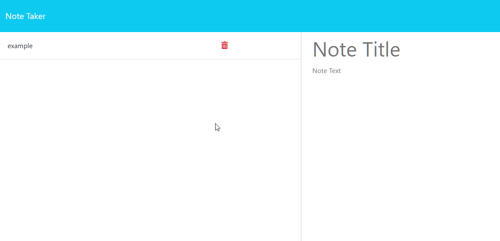

# 11 Express.js: Note Taker

## Overview

Simple note taking application that allows you to add, delete and edit your own notes

## Description 

* Implementing backend using `express` then link to finished front end 

* Includes a `db.json` file to store data and the `fs` module to handle it

* Using `uuvid:v4` to assign a unique id to each note for accessibility 

* Deployed using `Heroku`

## Installation
 
 > Requires advanced setup if you wanted to run on local machine using localhost port 3001

## Deployment 

[Heroku URL](https://note-taker-sws-8b20e871c90b.herokuapp.com)

## Preview 

